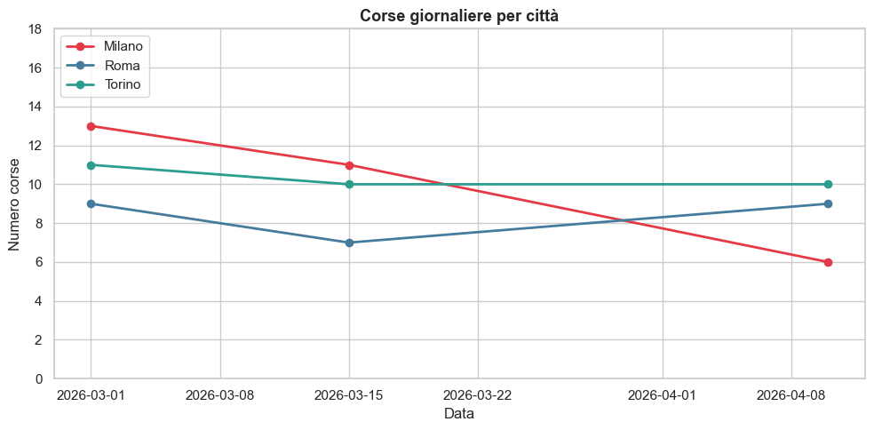
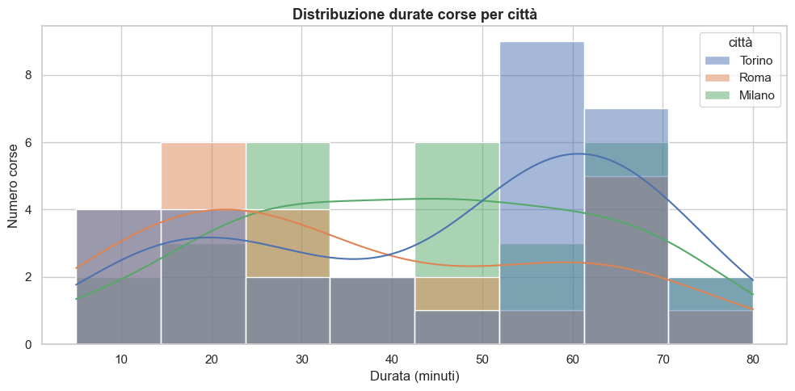
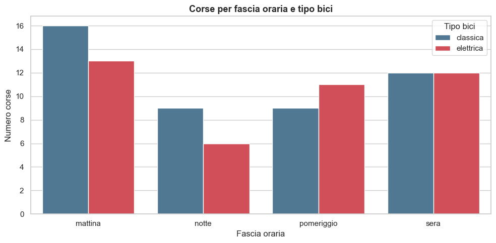
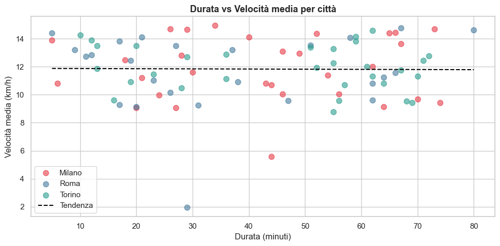
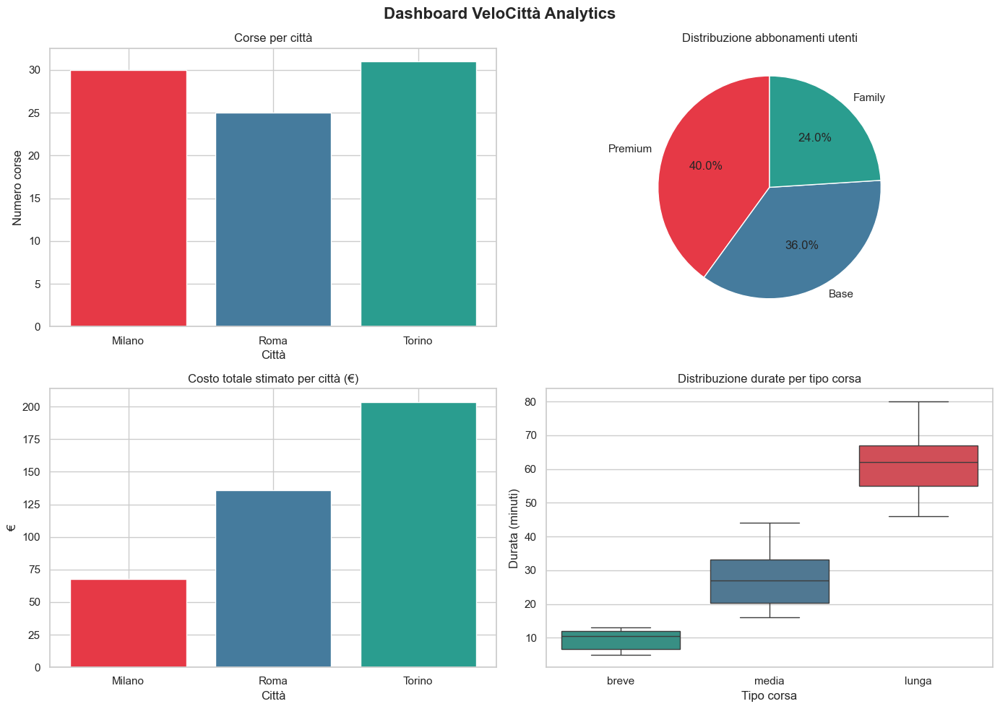
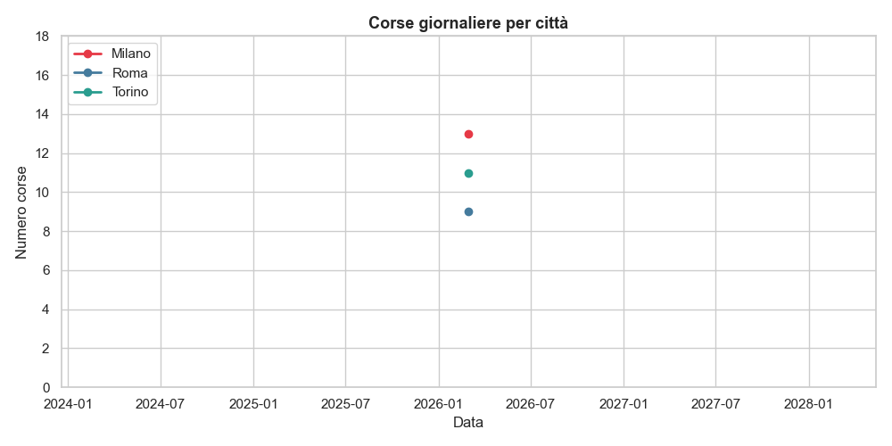

# VeloCittà Analytics 🚲

> Sistema di analisi end-to-end per il bike sharing italiano — Milano, Roma, Torino.

---

## Descrizione

VeloCittà Analytics è un progetto di analisi dati costruito per esplorare i pattern di utilizzo di un servizio di bike sharing attivo in tre città italiane. Il progetto copre l'intero ciclo di vita dei dati: dalla modellazione OOP della flotta, all'analisi numerica con NumPy, alla pulizia e aggregazione con Pandas, fino alla visualizzazione interattiva con Matplotlib e Seaborn. L'obiettivo è produrre insight concreti su durate, velocità, costi e distribuzione delle corse per supportare decisioni operative come la redistribuzione delle bici tra le stazioni.

---

## Struttura del progetto

```
VeloCitta_Analytics/
│
├── giorno_1/
│   └── demo.py                  # Funzioni di utilità (durata, classificazione, riepilogo)
│
├── modelli/
│   └── bici.py                  # Gerarchia OOP: Bicicletta, sottoclassi, FlottaBici
│
├── analisi/
│   ├── numpy_analisi.py         # Task 5 — Analisi numerica con NumPy
│   ├── pandas_pulizia.py        # Task 6.1-6.2 — Creazione e pulizia DataFrame
│   └── pandas_analisi.py        # Task 6.3-6.4 — Apply, aggregazioni, merge
│
├── visualizzazione/
│   └── grafici.py               # Task 7 — 5 grafici + animazione GIF
│
├── sql/
│   └── query.sql                # Task 4 — 6 query SQL con spiegazioni
│
├── tests/
│   └── test_demo.py             # Test automatici con assert
│
├── output/                      # Grafici PNG, GIF e CSV generati
├── main.py                      # Entry point — esegue tutto in sequenza
├── requirements.txt
└── .gitignore
```

---

## Installazione e avvio

**1. Clona il repository**
```bash
git clone https://github.com/tuo-username/velocita-analytics.git
cd velocita-analytics
```

**2. Installa le dipendenze**
```bash
pip install -r requirements.txt
```

**3. Esegui il progetto completo**
```bash
python3 main.py
```

**Oppure esegui i moduli singolarmente nell'ordine corretto:**
```bash
python3 analisi/numpy_analisi.py
python3 analisi/pandas_pulizia.py
python3 analisi/pandas_analisi.py
python3 visualizzazione/grafici.py
```

**4. Esegui i test**
```bash
python3 tests/test_demo.py
```

---

## Dipendenze

```
numpy>=1.24
pandas>=2.0
matplotlib>=3.7
seaborn>=0.12
pillow>=10.0
```

---

## Output

### Grafici

**Grafico 1 — Serie temporale corse per città**
> *Come varia il numero di corse nel tempo per ogni città?*



---

**Grafico 2 — Distribuzione durate per città**
> *Le durate delle corse sono simili tra Milano, Roma e Torino?*



---

**Grafico 3 — Corse per fascia oraria e tipo bici**
> *In quali fasce orarie si usano di più le bici elettriche?*



---

**Grafico 4 — Scatter durata vs velocità**
> *Le corse più lunghe sono anche più veloci o più lente?*



---

**Grafico 5 — Dashboard riepilogativa**
> *Panoramica generale delle performance di VeloCittà.*



---

**Animazione — Serie temporale (GIF)**
> *Evoluzione progressiva delle corse nel tempo.*



---

### CSV prodotti

| File | Descrizione |
|------|-------------|
| `output/df_corse_pulito.csv` | DataFrame corse dopo pulizia (86 righe, 10 colonne) |
| `output/df_bici.csv` | DataFrame flotta biciclette (20 righe) |
| `output/df_utenti.csv` | DataFrame utenti (25 righe) |
| `output/df_merged.csv` | DataFrame unificato corse + bici + utenti (86 righe, 21 colonne) |
| `output/stats_citta.csv` | Statistiche aggregate per città |
| `output/pivot_corse.csv` | Pivot table corse per città e tipo |

---

## Concetti implementati

| Area | Concetti |
|------|----------|
| **Python base** | Type hints, list comprehension, generator expression, `map()`, `try/except` |
| **OOP** | Ereditarietà, incapsulamento (`@property`), polimorfismo, `@classmethod`, `super()` |
| **SQL** | `SELECT`, `JOIN`, `GROUP BY`, `HAVING`, `LEFT JOIN` doppio con alias |
| **NumPy** | `ndarray`, slicing, fancy indexing, maschera booleana, broadcasting, normalizzazione min-max, correlazione di Pearson |
| **Pandas** | `DataFrame`, pulizia dati, `groupby + transform`, `apply`, `merge`, `pivot_table`, serie temporali |
| **Visualizzazione** | Matplotlib, Seaborn, `FuncAnimation`, `np.polyfit` |

---

## Considerazioni

**Cosa ho trovato difficile:** Coordinare i diversi moduli del progetto
(creazione dati → pulizia → analisi → grafici) senza che si sovrascrivessero
a vicenda. Ho dovuto ripensare l'ordine di esecuzione più volte, finché non
ho capito che `main.py` doveva lanciare gli script come processi separati con
`subprocess.run` invece di importarli come moduli, altrimenti i percorsi
relativi si "rompevano". Anche la struttura delle classi in `bici.py` mi ha
dato molto filo da torcere. Infine, la media mobile
in NumPy: ho scelto di implementarla con un ciclo `for` e lo slicing invece
di `np.convolve`, perché volevo essere sicuro di capire cosa stava calcolando
prima di usare una funzione più astratta.

**Cosa migliorerei:** Aggiungere test automatici con `pytest` invece dei test
manuali con `print`. Usare dati reali tipo da API open data dei comuni, per esempio. Inoltre,
separerei meglio la logica di business (come il calcolo del costo stimato)
dallo script Pandas, mettendola in `demo.py` per poterla riutilizzare anche in altri
moduli senza stare a duplicare codice.

**Osservazione sui dati:** La correlazione durata-km (0.9374) è alta perché
i km dipendono direttamente dalle durate.. non è una scoperta, ma è utile
avere il numero per documentarlo. Più interessante è la query D6 sul bilancio
stazioni: stazioni con bilancio positivo accumulano bici e rischiano di
saturarsi. È un problema che vedo nel quotidiano, quando mi capita di usare Gira qui a Lisbona, dove le stazioni vicino al centro storico e ai miradouros si svuotano in fretta
mentre quelle in salita si riempiono. Un sistema di alert automatico per gli
operatori potrebbe risolvere esattamente questo!

---

## Autore

**Gabriele De Carlo** — Corso Python per l'Analisi dei Dati, Formatemp 2026
